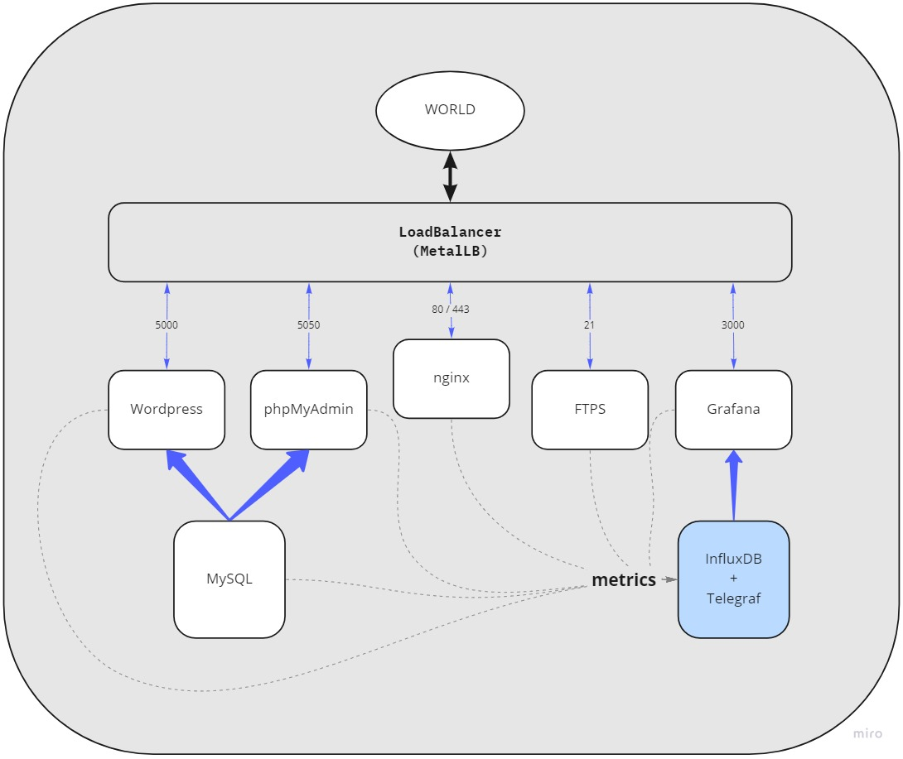

The project consists of setting up an infrastructure of different services and will introduce you to Kubernetes. There are serveral services will be built using minikube technology:
* MySQL
* phpMyAdmin
* Wordpress
* InfluxDB and Telegraf
* Grafana
* FTP

  

